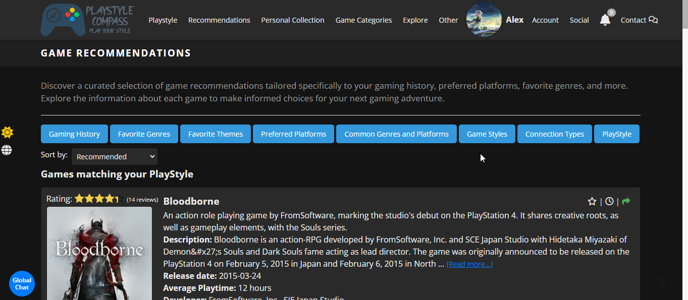
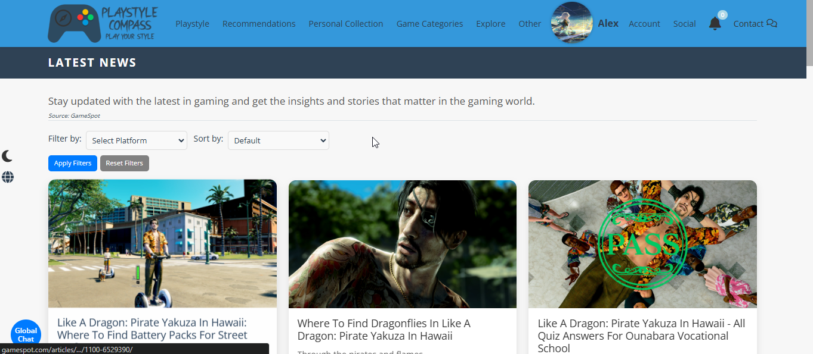

# PlayStyle Compass: Your Personalized Video Game Guide
- PlayStyle Compass is a personal guide to discovering video games tailored to your preferences, gaming history, and genre interests. Explore a vast library of games, franchises, and beloved characters, all tailored to your unique preferences and interests.

- Craft your own playstyle based on your interests and take our preference quiz for tailored game recommendations. Our detailed game data includes videos, descriptions, and everything you need to make informed decisions about your next gaming adventure.

- Create personalized lists of your favorite games and ones you can't wait to dive into. See who shares your gaming style and connect with like-minded players to discover new favorites together.

- Write and read reviews from fellow gamers, sharing your thoughts and insights on your favorite titles. Connect with friends, create friend lists, send messages, share your gaming experiences, and many other things to be discovered.

- Engage in global and private chats to connect with the gaming community or hold personal conversations with friends.

- Stay updated with the latest gaming news, including new releases, updates, and industry highlights.

- Explore game categories like Beginner-Friendly Games, Open World Adventures, and more to find titles that match your specific interests.

- Build a social network by following other users and discovering new games through their shared experiences.

- Customize your experience with the ability to switch between dark and light themes, ensuring a comfortable and visually appealing interface that suits your preference.

- Personalize Your Profile: Customize your profile with a picture and unique details like your gaming alias, current game, favorite title, and more to showcase your gaming identity.


### This guide will walk you through the steps to set up the PlayStyleCompass website locally, including setting up the Nginx server and generating SSL certificates.

#### Running the Website Locally Without Nginx
1. Configure your .env file as usual.
2. Set the environment variable SECURE_CONNECTION to 'False' to disable HTTPS enforcement during local development.
3. Open your browser and go to http://127.0.0.1:8000/en/ — do not use https://localhost/.

### Prerequisites
- Python 3.x installed
- Git installed
- pip installed
- [mkcert](https://github.com/FiloSottile/mkcert?tab=readme-ov-file#installation) installed for creating local SSL certificates
- [Nginx](https://nginx.org/en/download.html) downloaded

#### Option 1: Run the Website Locally
1. **Open a Command Prompt or Terminal.**
2. **Navigate to the Project's Root Directory (containing manage.py).**
3. **Install Required Packages:** `pip install -r requirements.txt`
4. **Set Up Environment Variables:** Create a file named '.env', paste the contents from 'env-example.txt' into '.env', and then fill the variables with your data.
5. **Apply Migrations:** 
```
python manage.py makemigrations
python manage.py migrate
```
6. **Run the Development Server:** `python manage.py runserver`
7. **Open the Website:** Visit https://localhost/ in your browser.

#### Option 2: Clone and Run the Website Locally
1. **Clone the Repository:** `git clone https://github.com/KhadaAke/PlayStyleCompass.git`
2. **Navigate to the Project Directory:** `cd PlayStyleCompass`
3. **Set Up a Virtual Environment:**
```
python -m venv env
source env/Scripts/activate  # For Windows
source env/bin/activate      # For macOS/Linux
```
4. **Install Required Packages:** `pip install -r requirements.txt`
5. **Set Up Environment Variables:** Create a file named '.env', paste the contents from 'env-example.txt' into '.env', and then fill the variables with your data.
6. **Apply Migrations:** 
```
python manage.py makemigrations
python manage.py migrate
```
7. **Run the Development Server:** `python manage.py runserver`
8. **Open the Website:** Visit https://localhost/ in your browser.

### Obtaining SSL Certificates with mkcert
1. **Install mkcert:** Follow the instructions [here](https://github.com/FiloSottile/mkcert?tab=readme-ov-file#installation)
2. **Generate Certificates:**
* Navigate to the directory where you want to save the certificates.
* Open CMD and run the following commands:
```
mkcert -install
mkcert localhost 127.0.0.1
```
* This will generate two files: localhost+2.pem (certificate) and localhost+2-key.pem (private key).

### Setting Up Nginx Server
1. **Download Nginx** 
* Download Nginx from [here](https://nginx.org/en/download.html).
* Extract the downloaded file.
2. **Configure Nginx:**
* Navigate to the 'conf' folder within the Nginx directory.
* Open the 'nginx.conf' file.
3. **Add Server Configuration:** Copy and paste the following server configuration into the 'nginx.conf' file, and modify it where necessary:
<details> 
    <summary>Nginx Server Configuration</summary>

	server {
        listen 80;
        server_name localhost 127.0.0.1;
        return 301 https://$host$request_uri;
    }

 	 server {
        listen 443 ssl;
        server_name localhost 127.0.0.1;

        ssl_certificate /path/to/your/certificate.crt;  # Modify this with the path to your certification files.
    	ssl_certificate_key /path/to/your/private.key;	# Modify this with the path to your certification files.

        ssl_protocols TLSv1.2 TLSv1.3;
        ssl_ciphers 'TLS_AES_128_GCM_SHA256:TLS_AES_256_GCM_SHA384:TLS_CHACHA20_POLY1305_SHA256:ECDHE-RSA-AES128-GCM-SHA256:ECDHE-RSA-AES256-GCM-SHA384';

        location /ws/ {
            proxy_pass http://127.0.0.1:8000;  # Daphne’s port
            proxy_http_version 1.1;
            proxy_set_header Upgrade $http_upgrade;
            proxy_set_header Connection "upgrade";
            proxy_set_header Host $host;
            proxy_set_header X-Real-IP $remote_addr;
            proxy_set_header X-Forwarded-For $proxy_add_x_forwarded_for;
            proxy_set_header X-Forwarded-Proto $scheme;
            proxy_buffering off;
        }

        location / {
            proxy_pass http://127.0.0.1:8000;  # Django’s port
            proxy_set_header Host $host;
            proxy_set_header X-Real-IP $remote_addr;
            proxy_set_header X-Forwarded-For $proxy_add_x_forwarded_for;
            proxy_set_header X-Forwarded-Proto $scheme;
            proxy_buffering off;
        }
    }
</details>

Websites for .env configuration: [GiantBomb](https://www.giantbomb.com/) / [SendGrid](https://sendgrid.com/) / [RECAPTCHA](https://www.google.com/recaptcha/about/)


## Project Preview





## All images can be found [here](https://github.com/miron-alexandru/PlayStyleCompass/tree/main/project-preview)


<details>
<summary><h2>PlayStyle Compass Changelog</h2></summary>

### Version v2.5:
* Created tests for the users app models.
* Created tests for the playstyle_compass app models.
* Users are able to copy the direct link to a game page with a single click.
* Added the option to share content via Link.
* Information about what is being shared added to the sharing pages for Polls, Deals, Game Lists and Game Reviews.
* Implemented game review sharing.
* Created single review page where users are able to view a single game review.

### Version v2.4:
* Notification received when a Deal is shared.
* Users are able to share Deals with their friends.
* Updated API for Deals.
* Created Deal details page.
* Deals can now be filtered by Stores.
* Paginated Community and Completed Polls.
* Solved bugs which caused the sorting on some pages to not carry over on pagination.
* Other CSS/HTML changes for Game Deals and Game Reviews.
* Implemented sorting for Game Deals.
* Game reviews can now be sorted.
* Created Game Reviews page.
* Created Game Deals page and added Game Deals on the index page.
* Added top rated games on the Index Page.
* Created API Documentation.
* Implemented Ordering and Filtering for the Games, Characters and Franchises APIs.
* Created APIs for: Characters, Games and Franchises
* Implemented API key functionality: Users can now generate an API key to access the PlayStyle Compass API.
* Added Completed Polls page: Users are able to browse through polls that are completed (ended).
* Polls now have a duration of 1 to 7 days.

### Version v2.3:
* Language preferences stored for each user when changing the language.
* Translated Notifications.
* Created Shared Polls page: Users are able to see the polls they or others shared with them.
* New info for polls and improved layout + CSS
* Users are able to share polls.
* Added Poll Detail page where users are able to view a single Poll.
* Users are able to Like Polls.
* Added Voted Polls page: Users are able to see all the polls they voted in.
* Added Polls: Users are able to create or vote on polls created by other users.
* Security improvements
* Implemented Global Chat: Users are able to communicate in the global chat.
* New Data about Games -> Playtime: The average playtime of each game is displayed.
* New Data about Games -> Stores: Users can visit online stores where the games are available for purchase.
* Created Popular Games page.
* Moved to the usage of a single db because of the unnecessary complexity of having two separate databases.
* Users are able to add game lists to their favorites / Created page where users can see their favorite game lists.
* Users are able to post, edit and delete comments (without page reload) on game lists.
* Users are able to leave comments on game lists.
* Created Public Game Lists page: Users are able to view game lists from other users that are public.
* Created Reviewed Game Lists page: Users are able to view game lists that they reviewed.
* Users are able to like game list reviews.
* Logo is updated based on the selected theme.

### Version v2.2:
* Implemented Dark Theme: Users are able to switch between the normal and dark theme.
* Users can like game lists.
* Users are able to review and rate game lists.
* Users can now easily track the sharing of game lists. They can view which users have shared specific game lists with them and see whom they have shared their own lists with
* Notifications when sharing a game list.
* Implemented Sorting for Game Lists and Shared Game Lists pages.
* Displaying the number of games and share count for each list.
* Implemented a page where users can view game lists they've received or shared.
* Implemented Game Lists: Users can create, edit, share, and delete custom game lists.
* Implemented Notification Settings: Users are able to customize what type of notifications they can receive.
* Added Following & Followers page.
* Implemented Followig System: Users are able to follow / unfollow other users.
* Added Beginner-Friendly games page.
* New recommendations based on PlayStyle.
* New recommendations based on connection types and game styles.
* Added new preferences: Connection Types & Game Styles
* Remember Me functionality added for login.
* Users are able to reset their profile details.
* New profile details added: Favorite Soundtrack, Gaming Alias, Current Game and Favorite Game Modes.
* Users are able to delete their account using email confirmation.
* Improved Google Account Login (css / html)
* Implemented google account login.

### Version v2.1:
* New pages for game categories: Steam Games, Free to Play Games, Indie Games, Open-World Games, Linear Gameplay Games
* Implemented Kindred Play Histories: Users can find other users that played similar games based on their gaming history.
* Description and Overview translated for Games.
* Implemented Similar Games: Users are able to view games that are similar to other games.
* Switched WebSocket connections from ws to wss for enhanced security.
* Chat updates: File attachment displayed in pinned messages / Message displayed when the pinned message is not found in chat / Minor CSS updated.
* Users are able to Pin / Unpin chat messages.
* Different CSS changes.
* Implemented Block List: Users are able to see users that they have blocked and are able to unblock them.
* Block / Unblock funcionality added to user profile.
* Users are able to block/unblock other users.
* Implemented Chats page where users are able to view their ongoing chat conversations with other users.
* Chat updates: Last Seen displayed when the users are offline in chat.
* Implemented Live Online/Offline status for users.

### Version v2.0:
* CSS Improvements in different locations of the Chat.
* Users are able to attach files to the messages and an indicator is displayed when a file is attached.
* Changed how the date of the messages currently being viewed is displayed: At the top of the chat, changing while scrolling based on the day of the messages.
* Chat Improvements: Date of the messages currently being viewed is displayed / Solved a bug which caused the Edit message textarea to remain on screen and unresponsive.
* Chat Improvements: Changing the background color of the chat / Searching through messages.
* Users are able to send a certain number of messages in a timeframe (spamming prevented).
* Security measures for XSS attacks.
* Message content is changing in real time for both users after message editing.
* Chat CSS improvements.
* Users are able to edit their messages (available 2 minutes for each message).
* Implemented Typing Feature: When an user is typing in chat there is a "User is typing..." message displayed to the other user.
* Chat Improvements: Chat header with options and warnings before deleting messages and visiting links.
* Improved overall visuals & functionality of chat.
* Implemented Chat: Users are able to write messages to each other in real time.

### Version v1.9:
* Improved how to pagination with filtering is done on Game Library and News.
* Solved a bug which caused the pagination to break after navigating to more than one page on the Game Library.
* Implemented sorting and filtering on the News page.
* All articles button added.
* Added hover effects and title display for games/franchises displayed on the Index page.
* Latest news page with all the news.
* Implemented Latest News Articles (related to gaming) on the Index page: Articles from [GameSpot](https://www.gamespot.com/) are retrieved using the GameSpot API and displayed on the Index page.
* Improved how system requirements are displayed.
* Refactored views and helper functions.
* Updated Logo.
* Improved Used Profile: In the profile details a hyperlink to the Favorite Game/Franchise/Character and Last Game Played is created.
* Reorganized navbar items.
* Improved Game Library: Users are able to sort the games and also a new filter: by Franchise
* Implemented Game Library: Users are able to browse games based on different filters like genres, themes and others.
* Changed how game rating is calculated.
* New sorting options for game recommendations: By title and by rating.

### Version v1.8:
* New profile details: favorite franchise, last game finished, preferred streaming platform.
* Updated CSS/HTML on the user profile / profile details.
* Users are able to provide and display on their profile new information about themselves (e.g. favorite game, genres, gaming setup).
* Improvements for System Requirements (CSS/HTML).
* System Requirements for the Games are now displayed.
* Preferences Quiz tweaks.
* Improved QuizRecommendation algorithm: Refactored for better maintainability / Now each time the user is taking the quiz, the recommended games are not the same to add diversity for recommendations.
* Added translations for QuizQuestions.
* Improved overall code to adapt for antipatterns in Django.
* Improved Preference Quiz: Improvements in views, html, recommendation algorithm. / More questions / Created a class to be able to read questions from a csv file and create QuizQuestion objects more easily.
* Implemented Preference Quiz: Users are able to take a quiz with different questions related to gaming preferences and based on the responses to receive game recommendations.

### Version v1.7:
* Implemented pages with Single-player and Multiplayer games.
* Dates for notifications / messages are displayed based on the user timezone.
* Implemented fractional star rating game ratings.
* Refactored views for playstyle compass and users apps.
* Improved reviews section profile clicking.
* Search bar added on view game page.
* Full profile name displayed on hover (for longer profile names).
* Restricted length for username and profile name.
* Updated translations.
* Refactored js files.
* Unique GUID retrieved from API for Game objects so the id remains consistent after any database changes.
* Now users can get recommendations based on their favorite themes.
* New platforms and genres for users to choose for their favorites.
* CSS improvements for better visual appeal.
* Added gameplay videos for each game.
* New data for characters: images & birthday / New data for franchises: images

### Version v1.6
* Added headers & header descriptions to all pages that needed it.
* Organized html files in different folders for easier maintainability.
* Searching for characters is available in the search bar.
* Refactored misc functions.
* Implemented Characters: Users are able to view different game characters and specific details about them.
* Fixed BUGS: Bug that caused the navbar to not appear / Updated translations / Made search bar dynamic based on the page that it exists.
* Added popular franchises on Index
* Formatting / Refactoring.
* Users are now able to search franchises just like searching games.
* Added franchises page where users can explore different franchises and read details about each of them.
* New game information: Franchise.
* Improved password validators.
* Finished translation + Language switcher.
* Implemented multilanguage (English/Romanian).
* Improved live notifications system.
* Implemented live notifications using Websockets.
* Implemented sorting by date for messages & shared games.
* Users are able to send messages to each other.
* Added DLC in game info.
* Added comments to views where necessary.
* Improved Similar Playstyles (HTML/CSS).
* Similar Playstyles page implemented: Users can find other users with a similar playstyle.

### Version v1.5
* Selective deletion of shared games.
* Users are able to view both games other users shared with them and games they shared with other users.
* Implemented Game Sharing: Users are now able to share games with the other users.
* Users are now able to show or hide their favorites, game queue and reviews on their profile. 
* Views refactored in playstyle_compass and users.
* Solved delete account BUG which caused users to be able to delete their account without email confirmation.
* Refactored recommendation helper functions into a RecommendationEngine class.
* Default profile picture at registration.
* Dynamic page headers for Reviews, Game Queue, Favorites
* Save all button on preferences page improved.
* Profile name change functionality improved.
* Profile image resized before change for better performance.
* Navbar / Scrollbar / Css changes and/or improvements. 
* Like-dislike feature improved.
* User profile improvements: Reviews, Likes, Favorites, Game Queue stats are displayed on the profile.
* User profile improvements: Remove friend / Friend request / Profile picture change functionality.
* Implemented User Profile: Now users are able to see their profile and the profile of other users.

### Version v1.4
* CSS/HTML Refactoring / Improvements.
* Added css adjustments for small screens.
* Implemented Likes and Dislikes for the reviews: Users are able to like or dislike a review.
* Removed Upcoming games from user preferences / Game recommendations 
* HTML Refactored
* Minor bug fixes.
* Added Reviews page where users are able to see all the games that they wrote a review for.
* Profile image of user added on Friends List and Friend Requests pages.
* Added Show/Hide functionality for passwords.
* Implemented Games Queue page.
* Code refactoring / Bugs solved in reviews description.
* Friends List improvements: Users are no longer able to send friend requests to users that are already their friends.
* Friends List Implementation:
- Send, receive, accept, decline, and cancel friend requests.
- View incoming and sent requests.
- Manage Friends List and unfriend users.

### Version v1.3:
* Upcoming games added to navbar.
* Profile name change has a cooldown of 1 hour.
* Modified how average score and total reviews are fetched to improve functionality.
* Profile name must be unique.
* Each user is able to Edit or Delete their own reviews for the games.
* Reimplemented reviews functionality.
* Users are now able to write reviews for the games.
* Improved the search bar and small tweaks for the search results page.
* Implemented Top Rated Games page, and also each game has an average rating displayed based on the review scores.
* Now reviews for the games are displayed.
* Views refactored into new helper functions.
* Games that are not yet released removed from recommendations and moved to a new category: Upcoming Games.
* Implemented email change confirmation.
* Added sorting options for the recommended games based on the release date.
* Users are now able to mark games as favorites and they can find them on the Favorite Games page.
* Added popular and upcoming games on the Home Page.
* Code refactored, improved documentation.

### Version v1.2:
* Css improvements.
* Improved the save buttons and save all button functionality on the my playstyle page.
* Implemented Save all button to save all preferences after modifying them.
* Users are now able to modify their preferences individually.
* Users are now able to change their Profile Name
* Improved CSS, added icons for different forms using [FontAwesome](https://fontawesome.com/)
* Users are not able to resend the email verification link.
* Implemented reCAPTCHA.
* Implemented email confirmation for the registration.
* Added profile name for the users.
* Modified css for different templates and placement of the footer.
* Refactored misc functions.
* Refactored CSS.
* Implemented Contact Us - Now users are able to fill a form and send an email for inquiries and communication.
* Added image gallery for each game.
* Added Read more - Read less funcionality for the Overview.
* Added new information about the games (Overview, Developers).
* Implemented pagination for the games recommendation page.
* Users are now also able to change their profile picture by directly clicking on it.
* Improved folder structure.

### Version v1.1:
* Views refactored.
* Implemented Profile Picture feature: Users can now personalize their profiles by adding profile pictures.
* Changed css styles for different templates.
* Modifications to password change view and form.
* Users are now also abe to change their email or password.
* Improved the password reset email template.
* Users are now able to delete their accounts.
* Improved index template.
* Improved password reset templates.
* Users now have the capability to reset their passwords.
* Integrated [Sendgrid](https://sendgrid.com/) APIs to facilitate the sending of password reset emails.
* Improved the base.html styling.
* Refactored the get_recommendations view function.
* Added recommendations based on the gaming history.
* Improved UI for the gaming preferences and preferences pages.
* Implemented default image that automatically takes the place of missing game images.
* Added database filtering: The games are filtered so that duplicate entries are eliminated from the games database.
* Introduced an advanced search bar on the index page, empowering users to seamlessly search for their desired games. The search bar incorporates an autocomplete feature, enhancing user experience and efficiency.

### Version v1.0:
* Improved overall code structure.
* Created .js files for the scripts used.
* Users now have the ability to apply filters. These filters include preferred genres, preferred platforms, and games that align with both the selected platforms and genres.
* Improved the recommendations page: Now an image of each game is displayed and also more details about the game are provided.
* Code refactored
* Improved registration and login pages 
* Implemented feature: Integrated database connectivity to compare the user's preferences with the games stored in the games database. The outcome is a list of game recommendations tailored to the user's preferences.
* Created a database for seamless storage of the acquired data.
* Utilized [Giant Bomb's API](https://www.giantbomb.com/) to efficiently gather essential game data.
* Implemented an enhanced folder structure to ensure the project's long-term maintainability.
* Added a distinct logo that enhances the site's visual identity.
* Elevated the user experience with better UI across all pages.
* Introduced dedicated CSS files to ensure consistent styling.
* Implemented user registration and login functionality.
* Created basic templates for different pages.
* Users can provide their gaming history, select preferred genres, and choose platforms to play on.
* Data is saved in a database for future reference.

